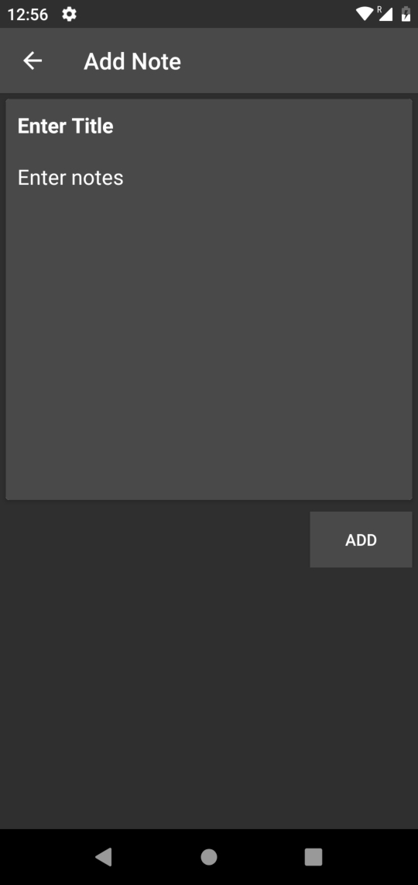
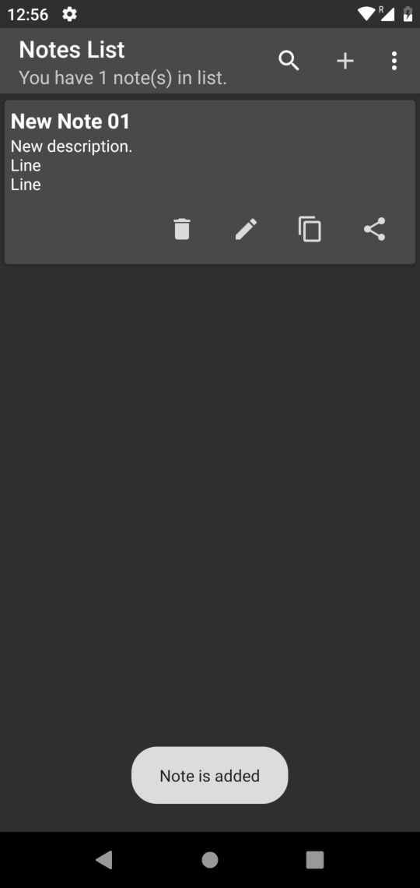
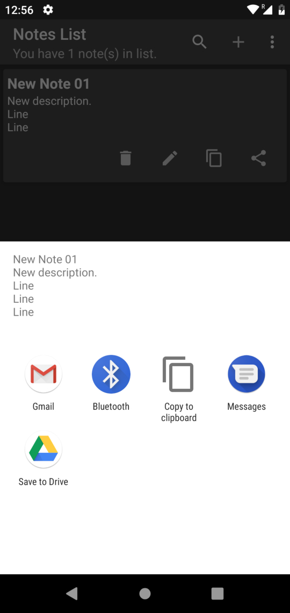
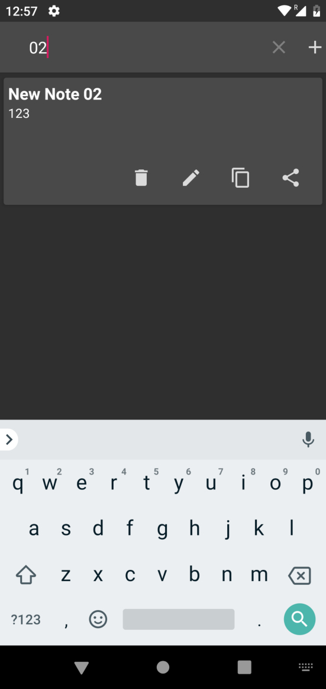

# SQLiteNoteApplication

In this application, We are used SQLite Database which is severless. When you setup the application, 
SQLite will create a database on your system to create tables(Notes) on your device.

